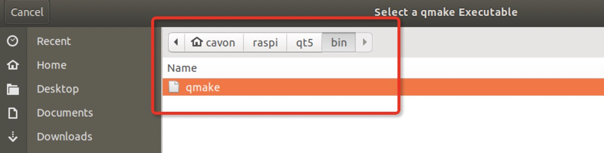

# Cross-compiling Qt (with QtWebEngine) for Raspberry Pi

- [Cross-compiling Qt (with QtWebEngine) for Raspberry Pi](#cross-compiling-qt-with-qtwebengine-for-raspberry-pi)
	- [Setup host computer](#setup-host-computer)
		- [Install dependencies](#install-dependencies)
		- [Copy cross compile tools amd extract it](#copy-cross-compile-tools-amd-extract-it)
		- [Download link helper](#download-link-helper)
		- [Download Qt](#download-qt)
	- [Setup Raspberry Pi](#setup-raspberry-pi)
		- [Install image file](#install-image-file)
		- [Setup ssh](#setup-ssh)
		- [Enable GL (FAKE KMS)](#enable-gl-fake-kms)
		- [Update Raspberry Pi, and install dependencies](#update-raspberry-pi-and-install-dependencies)
		- [Prepare cross compile environment](#prepare-cross-compile-environment)
	- [Cross compile QT](#cross-compile-qt)
		- [Sync system file from Raspberry Pi to your computer](#sync-system-file-from-raspberry-pi-to-your-computer)
		- [Compile](#compile)
		- [Setup Qt Creater](#setup-qt-creater)

## Setup host computer

You need a Linux OS for Cross compiling, Ubuntu is recomended

### Install dependencies

```bash
sudo apt update
sudo apt-get install build-essential gawk gcc g++ gfortran git texinfo libncurses-dev g++-multilib python pkg-config gperf bison flex libnss3-dev zlib1g-dev lib32z1-dev -y
```

Create a folder

```bash
mkdir raspi
cd raspi
```

### Copy cross compile tools amd extract it

```bash
mkdir -p ~/raspi/tools
wget https://releases.linaro.org/components/toolchain/binaries/7.4-2019.02/arm-linux-gnueabihf/gcc-linaro-7.4.1-2019.02-x86_64_arm-linux-gnueabihf.tar.xz
tar xf gcc-linaro-7.4.1-2019.02-x86_64_arm-linux-gnueabihf.tar.xz
```

### Download link helper

```bash
wget https://raw.githubusercontent.com/riscv/riscv-poky/master/scripts/sysroot-relativelinks.py
chmod +x sysroot-relativelinks.py
```

### Download Qt

```bash
cd ~/raspi
wget http://ftp.jaist.ac.jp/pub/qtproject/archive/qt/5.15/5.15.1/single/qt-everywhere-src-5.15.1.tar.xz
```

Extract it

```bash
cd ~/raspi
tar xf qt-everywhere-src-5.15.1.tar.xz

cp -R qt-everywhere-src-5.15.1/qtbase/mkspecs/linux-arm-gnueabi-g++ qt-everywhere-src-5.15.1/qtbase/mkspecs/linux-arm-gnueabihf-g++
sed -i -e 's/arm-linux-gnueabi-/arm-linux-gnueabihf-/g' qt-everywhere-src-5.15.1/qtbase/mkspecs/linux-arm-gnueabihf-g++/qmake.conf
```

## Setup Raspberry Pi

### Install image file

使Etcher烧写镜像, 烧写完成后， Etcher会自动弹出SD卡， 重新插拔SD卡。

### Setup ssh

打开boot盘，在文件夹内新建一个名称为ssh的文件，注意没有后缀名（Windows电脑要注意没有txt后缀，双击打开，如果提示打开方式说明正确。）文件内容不用管。不需要任何内容。

### Enable GL (FAKE KMS)

To enable Fake KMS, from the root `raspi-config` menu, go to:

```bash
Advanced Options -> A8 GL Driver -> G2 GL (Fake KMS)
```

That should enable KMS. If you are using a minimal build, you may be prompted to download some updates before this option becomes available. If asked, do so.

That is all we need to configure in `raspi-config`

### Update Raspberry Pi, and install dependencies

```bash
sudo nano /etc/apt/sources.list
```

Uncomment this line

```bash
# deb http://mirrors.tuna.tsinghua.edu.cn/raspbian/raspbian/ stretch main non-free contrib
deb-src http://raspbian.raspberrypi.org/raspbian/ buster main contrib non-free rpi
```

Upgrade Raspberry Pi

```bash
sudo rpi-update -y
sudo apt-get update
sudo apt-get dist-upgrade -y
sudo reboot
```

Install dependencies

```bash
sudo apt-get build-dep qt5-qmake -y
sudo apt-get build-dep libqt5gui5 -y
sudo apt-get build-dep libqt5webengine-data -y
sudo apt-get build-dep libqt5webkit5 -y

sudo apt install libnss3-dev libfontconfig1-dev libgstreamer1.0-dev libgstreamer-plugins-base1.0-dev libdbus-1-dev libssl-dev libpci-dev libminizip-dev libudev-dev libinput-dev libts-dev libxcb-xinerama0-dev libxcb-xinerama0 libxkbcommon-x11-dev gdbserver liblcms2-dev libjsoncpp-dev libevent-dev libvpx-dev ninja opus-tools protobuf-compiler libre2-dev snappy libxcomposite-dev -y
```

### Prepare cross compile environment

```bash
sudo mkdir /usr/local/qt5pi
sudo chown -R pi:pi /usr/local/qt5pi
```

Now your Raspberry Pi is ready.

## Cross compile QT

### Sync system file from Raspberry Pi to your computer

> If you jump from steps before, make sure you sync after dependencies on Raspberry Pi are installed and up-to-date, or sync again after updated. rsync will only sync differencies

```bash
rsync -avzRr --delete pi@<rpi_ipaddress>:/lib :/usr/include :/usr/lib :/opt/vc ~/raspi/sysroot

./sysroot-relativelinks.py sysroot
```

### Compile

Configure

```bash
mkdir build
cd ~/raspi/build
../qt-everywhere-src-5.15.1/configure -release -opengl es2 -device linux-rasp-pi4-v3d-g++ -device-option CROSS_COMPILE=~/raspi/tools/gcc-linaro-7.4.1-2019.02-x86_64_arm-linux-gnueabihf/bin/arm-linux-gnueabihf- -sysroot ~/raspi/sysroot -opensource -confirm-license -skip qtwayland -skip qtscript -skip qtandroidextras -skip qtcanvas3d -skip qtgamepad -skip qtmacextras -skip qtpurchasing -skip qtquickcontrols -skip qtwinextras -skip qtx11extras -make libs -prefix /usr/local/qt5pi -extprefix ~/raspi/qt5pi -hostprefix ~/raspi/qt5 -no-use-gold-linker -no-gbm -nomake examples -nomake tests -v -eglfs
```

> Note: if anything wrong happened, add an option `-v` to show verbose

Check configure output, make sure it match the information below

```bash
QPA backends:
  DirectFB ............................... no
  EGLFS .................................. yes	[SHOULD BE YES]
  EGLFS details:
    EGLFS OpenWFD ........................ no
    EGLFS i.Mx6 .......................... no
    EGLFS i.Mx6 Wayland .................. no
    EGLFS RCAR ........................... no
    EGLFS EGLDevice ...................... yes	[SHOULD BE YES]
    EGLFS GBM ............................ yes
    EGLFS VSP2 ........................... no
    EGLFS Mali ........................... no
    EGLFS Raspberry Pi ................... no	  [SHOULD BE NO]
    EGLFS X11 ............................ yes
  LinuxFB ................................ yes
  VNC .................................... yes
```

```bash
make
```

> Note: This may fail, just try again. As Qt Webengine is base on Chromium, and Chromium is huge, and need somuch RAM to compile. If error occurs, note the chromium compile file number, and try again, see if it change next try, and try until it finish.

```bash
cd ~/raspi/build/qtlocation/src/3rdparty/clip2tri
make
cd ~/raspi/build/qtlocation/src/3rdparty/clipper
make
cd ~/raspi/build/qtlocation/src/3rdparty/poly2tri
make
```

```bash
sudo make install
```

> If error: `/usr/bin/ld: cannot find -lclip2tri` prompt, try this and make again:

```bash
cd ~/raspi/build/qtlocation/src/3rdparty/clip2tri
make
cd ~/raspi/build/qtlocation/src/3rdparty/clipper
make
cd ~/raspi/build/qtlocation/src/3rdparty/poly2tri
make
```

use `rsync` to sync the compiled folder to Raspberry Pi

```bash
cd ~/raspi
cp -r qt5pi sysroot/usr/local
rsync -avz qt5pi pi@<rpi_ipaddress>:/usr/local
```

### Setup Qt Creater

Setup Qt Creator for Raspberry Pi cross compilation

If you do not have installed Qt Creator, follow the instructions in the [Qt download page](https://www.qt.io/download) to download and install it. Then, follow these instructions to configure cross-compilation support.

First, open Qt Creator, go to the **Tools** -> **Options** menu, select the **Devices** section on the left and Devices tab.

Add a new Generic Linux Device.

Set a name for the configuration (Raspberry Pi), the network name or IP and the username (pi).

Create a new ssh key for auto login


Deploy public key to Raspberry Pi

Before you finish the wizard, the connection to your Raspberry Pi will be verified and you will have then a new device configured in Qt Creator.

Next, go to the **Kits** section and **Compilers** tab, Add GCC C and C++ cross compilers for Raspberry Pi.


The path for the GCC C is
`~/raspi/tools/gcc-linaro-7.4.1-2019.02-x86_64_arm-linux-gnueabihf/bin/arm-linux-gnueabihf-gcc`

The path for the GCC C++ is
`~/raspi/tools/gcc-linaro-7.4.1-2019.02-x86_64_arm-linux-gnueabihf/bin/arm-linux-gnueabihf-g++`

Next, go to the **Debuggers** tab, and **Add** a debugger, set its path to `~/raspi/tools/gcc-linaro-7.4.1-2019.02-x86_64_arm-linux-gnueabihf/bin/arm-linux-gnueabihf-gdb`.

Go to the **Qt Versions** tab and **Add** a new version.

Select qmake in ~/raspi/qt5/bin/qmake.


Finally, go to the **Kits** tab, **Add** a new kit, set the name and icon you prefer, and pay attention to the following configuration:

- Device type: Generic Linux Device
- Device: Raspberry Pi (defaut for Generic Linux)
- Sysroot: ~/raspi/sysroot
- Compiler C: GCC (Raspberry Pi)
- Compiler C++: GCC (Raspberry Pi)
- Debugger: GDB (Raspberry Pi)
- Qt version: Qt 5.12 (Raspberry Pi)


> If device or compiler for Raspberry Pi didn't show up, you may need to click apply to apply the previous setup.


> Reference:
> - [Cross-compile and deploy Qt 5.12 for Raspberry Pi](https://mechatronicsblog.com/cross-compile-and-deploy-qt-5-12-for-raspberry-pi/)
> - [Raspberry Pi Cross Compiler Toolchain Installation Instruction](https://github.com/abhiTronix/raspberry-pi-cross-compilers/wiki/Cross-Compiler:-Installation-Instructions)